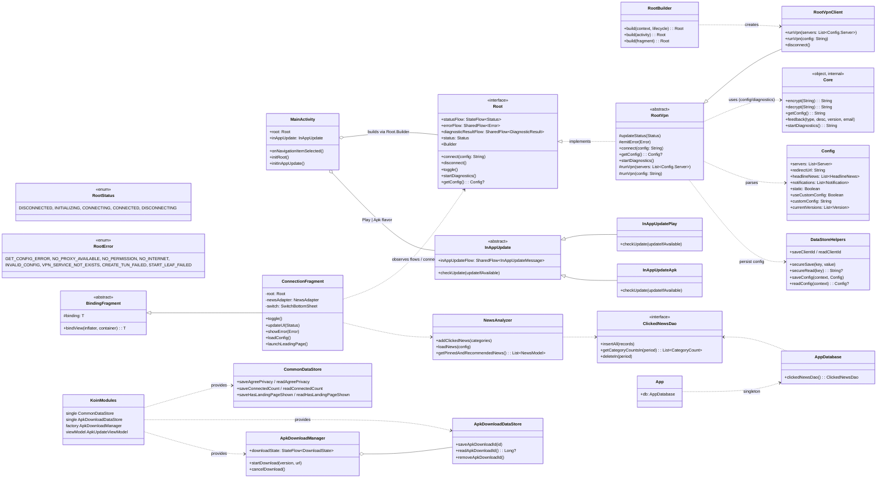
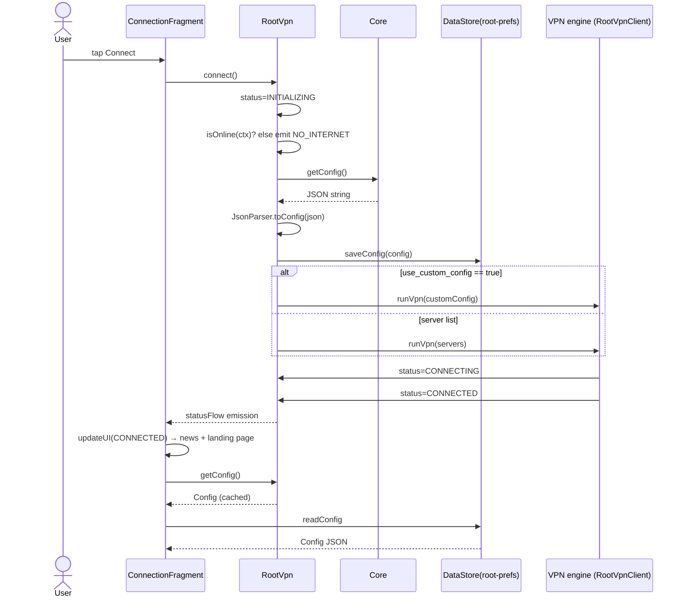
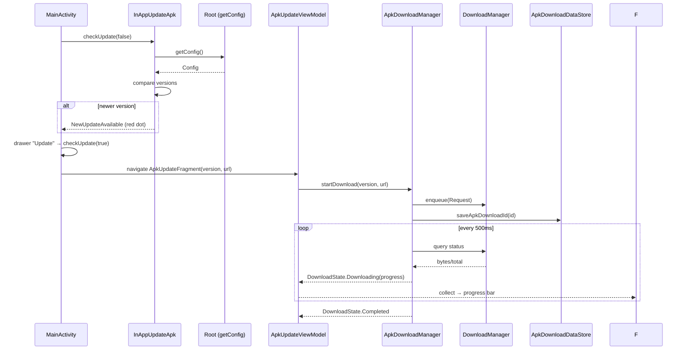
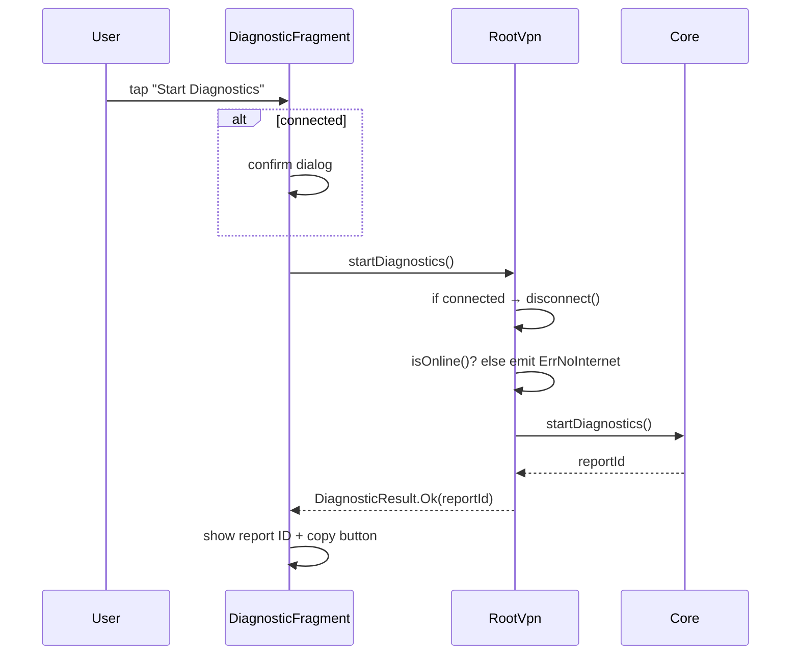

# Outline-vpn OS — Android Client Design Documentation

> Version 1.8.0 · Generated for new developers onboarding to the `outline-os-android` codebase.

---

## 1. Executive Summary

`outline-os-android` is an **open-source Android VPN client framework / white-label template**.
It ships a complete, production-shaped client shell — connection UI, VPN status lifecycle,
news feed with personalized recommendations, in-app update (Play Store / manual APK), diagnostics,
feedback, multi-language support, and a Navigation drawer — while deliberately leaving the two
hard engineering problems as **extension points for the developer**:

1. **Backend integration** — the `Core` object in the `core` module (config fetch, symmetric
   encryption, feedback submission, diagnostics upload).
2. **VPN tunnel engine** — the `RootVpnClient` class, which is currently a stub. It is designed to
   route traffic through the **Leaf** VPN SDK (https://github.com/eycorsican/leaf) and/or the
   **nthlink-outline** SDK, whose `.aar` is bundled in the (currently unwired) `outline/` module.

The app compiles and runs as a working UI shell out of the box. All that is missing is the real
proxy engine and the backend endpoints. The README documents these as "search for `TODO` and
implement 2 files."

### Project at a glance

| Aspect | Value |
|---|---|
| App name / package | `outline` / `com.outline.android.client` |
| versionName | `6.8.0` |
| Modules | `:app` (client), `:core` (engine seams + models + storage), `outline/` (legacy, unwired) |
| minSdk / targetSdk / compileSdk | 26 / 36 / 36 |
| JVM target | 11 |
| Kotlin | 2.2.21 · AGP 8.13.0 · Gradle wrapper |
| Architecture style | Layered shell + feature packages, single-activity with Navigation Component, coroutines/Flow, ViewBinding, Koin DI, Room + Preferences DataStore |

---

## 2. Requirements

### 2.1 Functional requirements (as shipped)

- Launch splash screen with a privacy-policy gate (first run only).
- Connect / disconnect a VPN via a large toggle + draggable bottom sheet on the home screen.
- Stream VPN `Status` and `Error` events to the UI reactively (StateFlow / SharedFlow).
- Fetch a remote JSON `Config` from a "Directory Server": proxy server list, landing-page URL,
  headline news, notifications, in-app version table.
- Show a news list on successful connection and personalize ordering by recently clicked
  categories (30-day window, Room).
- Open the configured landing page and news items inside an in-app `WebView` (with cookie clearing,
  custom UA, progress bar, copy / open-in-browser / share).
- In-app update checks on startup: Play Core immediate updates for Play-installed builds,
  `DownloadManager`-based APK download for sideloaded builds, with resume support and a
  notification-to-update-screen receiver.
- Diagnostics: disconnects the VPN, runs backend diagnostics, and surfaces a Report ID.
- Feedback form (category + description + optional email) submitted to the backend.
- About / Follow-Us pages, links to FAQ/Policies/Download, Google Play rating prompt after
  connect counts 10/15/20, and a "Kill Switch" hint that opens system VPN settings.
- ~30 localized string locales (with dark-theme resources enforcing light UI).

### 2.2 Developer-implemented requirements (TODO extension points)

| File | Functions to implement |
|---|---|
| `core/.../Core.kt` | `encrypt()`, `decrypt()`, `getConfig()`, `feedback()`, `startDiagnostics()` |
| `core/.../RootVpnClient.kt` | `runVpn(servers)`, `runVpn(config)`, `disconnect()` |

These are the only required implementation points — the rest of the app is complete.

### 2.3 Non-functional / environmental

- Works offline: no-network guarded before any connection attempt.
- All cleartext HTTP disabled via `network_security_config.xml` (system trust anchors only).
- Night mode disabled at `Application` level (`MODE_NIGHT_NO`).
- WebView metrics opt-out declared in the manifest.
- `android:allowBackup="false"`.

---

## 3. Architecture Design

### 3.1 Module layout

```text
nthlink-os-android/
├── app/        Android application (UI shell, features, storage, DI)
├── core/       Android library (VPN abstraction, backend seams, models, encrypted storage)
└── outline/    Legacy local module exposing nthlink-outline.aar (NOT in settings.gradle — dead code)
```

`settings.gradle` includes only `:app` and `:core`. The `outline/` directory contains an
`nthlink-outline.aar` plus a `build.gradle` that exposes it as a `default` artifact, but because it
is absent from `settings.gradle` it is currently **not compiled or linked**. It is retained as a
convenience for the future VPN engine implementation.

### 3.2 Core module — `com.nthlink.android.core`

The **engine-agnostic contract + backend seams**. It has *no* UI and *no* VPN SDK dependency yet.

- **`Root`** (interface) — the single facade the UI talks to:
  - Reactive streams: `statusFlow: StateFlow<Status>`, `errorFlow: SharedFlow<Error>`,
    `diagnosticResultFlow: SharedFlow<DiagnosticResult>`.
  - Operations: `connect(config)`, `disconnect()`, `toggle()`, `startDiagnostics()`, `getConfig()`.
  - `Root.Builder` constructs and lifecycle-binds an implementation:
    `build(context, lifecycle)`, `build(activity)`, `build(fragment)`.
  - Companion functions delegating to `Core` for config/feedback.
- **`RootVpn`** (abstract, `DefaultLifecycleObserver`) — shared orchestration logic:
  - Connects internet check → fetch/save config → dispatch to abstract `runVpn(...)`.
  - Handles `use_custom_config` vs server-list modes and their error cases.
  - Diagnostics: disconnect → online check → `Core.startDiagnostics()` → emit result.
  - Protects state via `updateStatus()` / `emitError()`.
- **`RootVpnClient`** (concrete) — TODO stub; the place where Leaf/Outline/VpnService is wired.
- **`Core`** (internal object) — the backend integration seam (TODO stubs, `getConfig()` returns
  sample JSON with servers/news/versions).
- **`model/`** — `Config` (servers, news, notifications, versions), `DiagnosisReport`,
  `RequestResult`, `VerifyResult` — all `@Serializable` via kotlinx.serialization.
- **`storage/`** — Preferences DataStore named `root-prefs` with generic `save/read/remove` and
  `secureSave/secureRead` wrappers that call `Core.encrypt/decrypt` (plaintext until implemented).
  Stores the last config (server list stripped before persisting) and an auto-generated `clientId`.
- **`utils/`** — `JsonParser` (lenient JSON codec), `isOnline()` via ConnectivityManager,
  UTC/timezone helpers, constants (`EMPTY`, `ZERO`, `NO_RESOURCE`).

### 3.3 App module — `com.nthlink.android.client`

Layered shell: **Activities → Navigation fragments → feature packages → storage/infra**, with Koin
DI supplying infra to the UI.

- **App launch / privacy gate**: `LaunchActivity` hosts `launch_graph`
  (`LaunchFragment` splash → `PrivacyFragment` on first run) then starts `MainActivity`.
- **`MainActivity`** — single shell activity:
  - Builds `Root` via `Root.Builder().build(this)` (a `lateinit` exposed to fragments).
  - Holds the Navigation drawer + toolbar; locks/unlocks drawer per destination.
  - Owns `InAppUpdate` orchestration (Play or APK flavor chosen at runtime by install source).
  - Handles navigation for all drawer items and intents from `ApkDownloadReceiver`.
- **Feature UI** (all fragments extend `BindingFragment`, observe `Root` flows, use Koin):
  - **Connection** — `ConnectionFragment`, `SwitchBottomSheet`, `NewsAdapter`/`NewsItem`.
  - **Web** — `WebFragment` + `CustomWebChromeClient` (`WebUtils`).
  - **Feedback** — `FeedbackFragment`.
  - **Diagnostic** — `DiagnosticFragment`.
  - **Update** — `ApkUpdateFragment` + `ApkUpdateViewModel`.
  - About / FollowUs / Privacy / Launch.
- **Updates subsystem**:
  - `InAppUpdate` (abstract, lifecycle observer) → `InAppUpdatePlay` (Play Core app-update) /
    `InAppUpdateApk` (config-version compare + APK download).
  - `ApkDownloadManager` wraps `DownloadManager` with a `StateFlow<DownloadState>` monitor.
  - `ApkDownloadDataStore` persists the download id across restarts (resume).
  - `ApkDownloadReceiver` redirects system download-notification clicks into `ApkUpdateFragment`.
- **Storage**:
  - Room: `AppDatabase` (single `ClickedNews` entity) + `ClickedNewsDao` + `NewsAnalyzer`
    (category-based personalization, 30-day window).
  - Preferences DataStore: `CommonDataStore` (`nthlink-prefs`: privacy agreed, connected count,
    landing page shown), `ApkDownloadDataStore` (`apk-download-prefs`).
- **DI (Koin)** — `appModule`: `single` CommonDataStore, ApkDownloadDataStore;
  `factory` ApkDownloadManager; `viewModel` ApkUpdateViewModel.

### 3.4 Design principles observed

- **Engine/backend replaced via seam, not via rewriting UI.** Implement two files, keep the shell.
- **Reactive UI** — all long-running state is exposed as Flows; fragments collect with
  `repeatOnLifecycle(STARTED)`.
- **Single-activity + Navigation Component + SafeArgs** with two nav graphs.
- **No ViewModel layer for most screens** — Root is a single shared state holder injected from the
  activity, deliberate simplification; `ApkUpdateViewModel` is the exception.

### 3.5 Key third-party dependencies

| Dependency | Version | Used for |
|---|---|---|
| AndroidX core-ktx / appcompat / constraintlayout | 1.17.0 / 1.7.1 / 2.2.1 | UI base |
| Navigation (fragment/ui/safeargs) | 2.9.5 | Two-graph navigation |
| Lifecycle runtime-ktx | 2.9.4 | Flows / observers |
| DataStore preferences | 1.1.4 | 3 preference stores |
| Room (ktx + compiler via KSP) | 2.8.3 | News click tracking |
| WorkManager (runtime-ktx) | 2.11.0 | (declared; available for scheduling) |
| Material Components | 1.13.0 | Drawer, bottom sheet, dialogs |
| kotlinx-serialization-json | 1.9.0 | Config/Report JSON |
| Koin (koin-android) | 4.1.1 | DI graph |
| Play core review-ktx | 2.0.2 | In-app rating review |
| Play in-app-updates (app-update-ktx) + coroutines-play-services | 2.1.0 / 1.10.2 | Play update flow |
| JUnit / Espresso / AndroidX test | — | Test scaffolding (placeholder) |
| Leaf VPN SDK / nthlink-outline | not yet wired | **In-progress** VPN tunnel (TBD by developer) |

---

## 4. Class Diagram



---

## 5. Key Flows

### 5.1 App startup & privacy gate

1. `LaunchActivity` starts → `launch_graph` → `LaunchFragment`.
2. After a 2s delay, read `CommonDataStore.readAgreePrivacy()`.
   - **true** → `MainActivity.start()` and finish.
   - **false** → navigate to `PrivacyFragment` ("Accept and continue" saves `agreePrivacy = true`
     then moves to `MainActivity`).

### 5.2 Start in `MainActivity`

1. `App.onCreate`: create `AppDatabase`, force light mode, `startKoin(appModule)`.
2. `MainActivity.onCreate`: build `Root` from `Root.Builder().build(this)`, pick update flavor by
   `installFromGooglePlay()`, register lifecycle, collect `inAppUpdateFlow`, kick off
   `checkUpdate(updateIfAvailable = false)` (shows a red dot on the drawer when a release exists).

### 5.3 VPN connect

1. `ConnectionFragment` collects `statusFlow`/`errorFlow`.
2. User taps toggle → `root.connect()` (only allowed from `DISCONNECTED`).
3. `RootVpn.connect()`:
   - `INITIALIZING` → offline check (`isOnline`) → fail fast with `NO_INTERNET` if offline.
   - If a custom `config` string was passed → `runVpn(config)` directly.
   - Else `getConfigFromDirectoryServer()`: `Core.getConfig()` → parse `Config` →
     `saveConfig()` → if `use_custom_config` use `customConfig` else `runVpn(servers)`.
   - Dispatch to the (TBD) engine which transitions `CONNECTING → CONNECTED`.
4. On `CONNECTED`: expand news UI, `loadConfig()` (populate static indicator + news list with
   personalized sort), launch the landing page once, increment connect count (rating trigger at
   10/15/20).
5. Errors are mapped to localized dialogs; negative button jumps to Feedback.

### 5.4 VPN disconnect

`root.disconnect()` → engine cleanup → `DISCONNECTING → DISCONNECTED`.
UI resets the toggle, collapses news, prunes expired clicked-news (>30 days) via Room.

### 5.5 Update check (two flavors)

- **Play build** (`InAppUpdatePlay`): `AppUpdateManager.appUpdateInfo` →
  if `UPDATE_AVAILABLE` + `IMMEDIATE` allowed → emit `NewUpdateAvailable`; on `onResume` resumes a
  developer-triggered update already in progress; drives `StartIntentSenderForResult`.
- **APK build** (`InAppUpdateApk`): reads `root.getConfig().currentVersions[...]` for the Android
  platform, compares version strings against `BuildConfig.VERSION_NAME`, and either shows a red dot
  or navigates to `ApkUpdateFragment`.

### 5.6 APK download & install

1. `ApkUpdateFragment` gets `version` + `url` args → `ApkUpdateViewModel.startDownload()`.
2. `ApkDownloadManager.startDownload()`: cancel old, wipe `nthlink_updates/`, enqueue a
   `DownloadManager` request to `getApkFile(version)`, save id to `ApkDownloadDataStore`, poll
   status every 500 ms → `StateFlow<DownloadState>`.
3. On process restart, `ApkDownloadManager.init` resumes monitoring for a saved (still running) id.
4. User taps the system download notification → `ApkDownloadReceiver` re-launches
   `MainActivity` with `ACTION_OPEN_APK_UPDATE` → `MainActivity.handleIntent` → `updateApp()` →
   navigates to `ApkUpdateFragment`.
5. User installs the APK manually from Files/Downloads (self-install is intentionally out of scope).

### 5.7 News personalization

1. `ConnectionFragment.onSwitchExpanded()` / `loadConfig()` → clears cookies, then submits
   `NewsAnalyzer.getPinnedAndRecommendedNews()`.
2. `NewsAnalyzer.loadNews(config)` maps notifications + headline news, scoring news by how many
   times the user clicked each category in the last 30 days (`ClickedNewsDao.getCategoryCountsIn`).
3. Clicking a news item records categories in Room (`addClickedNews`) and opens the item in
   `WebFragment`.

### 5.8 Diagnostics

`DiagnosticFragment` → `root.startDiagnostics()` (with a confirm dialog if connected):
disconnect → online check → `Core.startDiagnostics()` → emit
`DiagnosticResult.Ok(reportId)` (or `ErrNoInternet`) → copy-to-clipboard Report ID.

### 5.9 Feedback

`FeedbackFragment` (issue category dropdown localized to English before send) →
`Root.feedback(...)` → `Core.feedback(...)` (TODO: backend POST) → success/failure dialogs.

---

## 6. Sequence Diagrams

### 6.1 Connect (directory-server flow)



### 6.2 APK update check → download



### 6.3 Diagnostics



---

## 7. Developer Guideline

### 7.1 Where to implement (the whole point of the framework)

1. **`core/.../Core.kt`**
   - `getConfig()` — fetch JSON from your backend / Directory Server. The returned JSON shape must
     match `Config` (`servers`, `redirectUrl`, `headlineNews`, `notifications`, `data`, `static`,
     `use_custom_config`, `custom_config`, `current_versions`).
   - `encrypt()/decrypt()` — symmetric cipher for encrypted DataStore persistence (`secureSave` /
     `secureRead`). Security note: default is identity (plaintext!). Use AES-GCM with a key derived
     from a secret or Keystore-backed key.
   - `feedback(...)` — POST feedback to your backend; throw on failure so the UI shows the error
     dialog.
   - `startDiagnostics()` — collect diagnostics and return a report ID.
2. **`core/.../RootVpnClient.kt`**
   - `runVpn(servers)` — start the tunnel with the server list (selecting best server).
   - `runVpn(config)` — start the tunnel with a raw config string (Leaf config / URL).
   - `disconnect()` — stop the tunnel and release resources.
   - Expected behavior: drive status through `updateStatus(CONNECTING → CONNECTED)` and
     `emitError(...)` (e.g. `NO_PERMISSION`, `CREATE_TUN_FAILED`, `START_LEAF_FAILED`).
   - Hint: a VPN engine needs a `VpnService` (see Android `VpnService.Builder`), a notification for
     the foreground service, and the Leaf / nthlink-outline native libs. The `outline/` module
     contains `nthlink-outline.aar` for this purpose.

### 7.2 Code conventions

- **Binding**: all screens extend `BindingFragment<ViewBinding>`; do not keep `_binding` after
  `onDestroyView`.
- **State**: expose everything long-running as Flows; collect inside `repeatOnLifecycle(STARTED)`.
- **`Root` access**: fragments use `getRoot()` from `FragmentX.kt` (activity holds the single Root).
- **DI**: add infra to `appModule` in `KoinModules.kt` using `singleOf`/`factoryOf`/`viewModelOf`.
- **Serialization**: models are `@Serializable` with explicit `@SerialName`; parse via the lenient
  `JsonParser` (ignores unknown keys, coerces null to defaults).
- **Strings**: never hardcode user-facing strings; add to all `values-*/strings.xml` locales.
- **Storage**: single-purpose Preferences DataStore names (`root-prefs`, `nthlink-prefs`,
  `apk-download-prefs`); Room for relational data (currently only `clicked_news`).
- **No comments required**; follow existing file topology (feature packages under `ui/`).

### 7.3 Pro tips

- Keep the lightweight UI. Behavior changes belong in `Root`/`Core`, not fragments.
- Version bump: `app/build.gradle` `versionName` must match `current_versions` entries in your
  backend JSON or the APK installer will never flag an update.
- The update flavor auto-switches by install source — you don't need a build flag.
- Landing page/news URLs come from the backend config; hardcoded sample URLs in `Core.kt` are
  placeholders only.

---

## 8. Installation Guideline

### 8.1 Prerequisites

- JDK 17 (AGP 8.x requirement; project targets Java 11 bytecode).
- Android Studio (latest stable, Hedgehog or newer) with Android SDK **compileSdk 36** accepted.
- Internet access for first Gradle sync (Google Maven, Maven Central, JitPack).

### 8.2 Open & build

1. Clone:
   ```bash
   git clone <repo-url> D:\OpenSource\nthlink-os-android
   ```
2. Open the project root in Android Studio (it picks up `settings.gradle`).
3. Let Gradle sync (uses the wrapper — no manual Gradle install needed).
4. Build the debug APK:
   ```bash
   ./gradlew :app:assembleDebug     # (gradlew.bat on Windows)
   ```
5. Install on a device/emulator:
   ```bash
   ./gradlew :app:installDebug
   ```
6. Run tests:
   ```bash
   ./gradlew :app:testDebugUnitTest :core:testDebugUnitTest
   ```

### 8.3 Post-build sanity checklist

- App launches onto splash → privacy (first run) → connection home.
- Toggle shows real state transitions only after `RootVpnClient` is implemented (stub sleeps 1s).
- No crashes on configuration change / process death (flows + lifecycle-safe collection).

---

## 9. Review Recommendations

Priority-ordered review findings for the maintainers:

### High priority

1. **VPN engine is a stub** — the app currently cannot route traffic. `RootVpnClient` fakes
   `CONNECTING/CONNECTED`. This is the core deliverable (README makes it intentional, but it must be
   flagged before any "release" claims).
2. **`Core.encrypt/decrypt` are identity functions** — `secureSave` writes plaintext to disk in
   practice. Implement AES-GCM with Keystore-backed keys before shipping.
3. **`outline/` module is dead code** — the AAR is git-tracked and a `build.gradle` exists, but
   `settings.gradle` never includes `:outline`. Decide: wire it (`include ':outline'` +
   `implementation project(':outline')`) so the VPN engine can use it, or delete the directory and
   document the Leaf SDK approach in `core/build.gradle`.
4. **No `VpnService` / foreground-service / notification plumbing** — a real VPN needs the system
   consent flow and a persistent notification; not present in the manifest yet.

### Medium priority

5. **Sample config & content in `Core.getConfig()`** are hardcoded product URLs + real-looking news —
   must be replaced by the real backend; ensure the strict `network_security_config` (no cleartext)
   matches your endpoints.
6. **Tests are placeholders** — only `ExampleUnitTest`/`ExampleInstrumentedTest` exist. Add unit
   tests for `NewsAnalyzer` sorting, version comparison (`InAppUpdateApk`), `SwitchBottomSheet`
   state logic, and the `Config` codec.
7. **Download error strings are Hardcoded English** in `ApkDownloadManager.getFailureReason` —
   should be localized string resources.
8. **`LaunchFragment` uses a fixed 2s delay** — consider the AndroidX Splash Screen API instead of a
   sleep.
9. **Version comparison is naive** — `InAppUpdateApk.isNewUpdateAvailable` parses segments with
   `toInt()` and short-circuits early; fails on suffixes (e.g. `6.8.0.1-rc1`) and partial compares.
   Consider `versionName` parity with `versionCode`.
10. **Room schema not exported** — no `exportSchema` set; with a version bump the migration story is
    unwritten (currently version 1, single table, acceptable).

### Low priority / polish

11. **R8/ProGuard disabled** — `minifyEnabled false` for release; enable later and add keep rules for
    the VPN native SDK and serialization.
12. **Three separate DataStore files** — acceptable but consider consolidation or documented naming
    convention to avoid proliferation.
13. **`isOnline()`** only checks transport presence, not actual reachability — a captive portal or
    no-route network would pass the check and fail later with a generic error.
14. **`downloads` URI / `DIRECTORY_DOWNLOADS`** requires no permission on modern Android but the
    manual "open Files app" install flow is clunky — a `FileProvider` + install intent is a nicer UX.
15. **Hardcoded social URLs** in `FollowUsFragment` — move to resources for localization/branding.
16. **CI** — no `.github/workflows` or lint config; recommend adding `./gradlew lint` to CI and a
    baseline.

---

## 10. Dependencies & Packages

Complete dependency map of the project. Declared in `build.gradle` (root + modules) and resolved via
Google Maven, Maven Central, and JitPack (`settings.gradle`).

### 10.1 Build toolchain & Gradle plugins (root `build.gradle`)

| Plugin / tooling | Version | Role |
|---|---|---|
| Gradle (wrapper) | per `gradle/wrapper` | Build driver |
| AGP `com.android.application` / `com.android.library` | 8.13.0 | Android build |
| Kotlin Android `org.jetbrains.kotlin.android` | 2.2.21 | Kotlin compilation |
| Kotlin serialization plugin | 2.2.21 | `@Serializable` codegen |
| KSP `com.google.devtools.ksp` | 2.2.21-2.0.4 | Room & SafeArgs annotation processing |
| Navigation SafeArgs (buildscript) | 2.9.5 | Type-safe navigation args |
| JDK / bytecode target | JDK 17 toolchain → Java 11 bytecode | Compile/target |

### 10.2 Runtime dependencies — `:app` (`com.nthlink.android.client`)

| Library | Version | Used for |
|---|---|---|
| androidx.core:core-ktx | 1.17.0 | Core Kotlin extensions |
| androidx.appcompat:appcompat | 1.7.1 | Activity/Compat base |
| androidx.constraintlayout | 2.2.1 | Layouts |
| androidx.navigation (fragment-ktx, ui-ktx, safeargs) | 2.9.5 | NavHost graphs, drawer wiring |
| androidx.lifecycle:lifecycle-runtime-ktx | 2.9.4 | Flows, lifecycle observers/coroutine scope |
| androidx.datastore:datastore-preferences | 1.1.4 | `nthlink-prefs`, `apk-download-prefs` stores |
| androidx.drawerlayout | 1.2.0 | Navigation drawer (lock/unlock) |
| androidx.work:work-runtime-ktx | 2.11.0 | WorkManager (declared; scheduled-work ready) |
| androidx.room (room-ktx + room-compiler via KSP) | 2.8.3 | `AppDatabase`, `ClickedNewsDao` |
| org.jetbrains.kotlinx:kotlinx-serialization-json | 1.9.0 | JSON parsing helpers |
| com.google.android.material:material | 1.13.0 | Drawer, BottomSheet, Material dialogs |
| com.google.android.play:review-ktx | 2.0.2 | In-app rating review |
| com.google.android.play:app-update-ktx | 2.1.0 | Play immediate in-app updates |
| kotlinx-coroutines-play-services | 1.10.2 | Await Play Core Task<> APIs |
| io.insert-koin:koin-android | 4.1.1 | DI (`appModule`) |
| project(":core") | — | Engine seam, models, storage |

### 10.3 Runtime dependencies — `:core` (`com.nthlink.android.core`)

| Library | Version | Used for |
|---|---|---|
| androidx.core:core-ktx | 1.17.0 | Kotlin extensions |
| androidx.appcompat:appcompat | 1.7.1 | Context/compat support |
| androidx.lifecycle:lifecycle-runtime-ktx | 2.9.4 | `Root` flows, lifecycle scopes |
| androidx.datastore:datastore-preferences | 1.1.4 | `root-prefs` secure store |
| org.jetbrains.kotlinx:kotlinx-serialization-json | 1.9.0 | `Config` / report codecs |
| Leaf SDK / nthlink-outline `.aar` | not wired | **In-progress** VPN tunnel (`outline/` module) |

### 10.4 Test dependencies

| Scope | Library | Version |
|---|---|---|
| `testImplementation` (`:app`) | junit | 4.+ |
| `testImplementation` (`:core`) | junit | 4.13.2 |
| `androidTestImplementation` | androidx.test.ext:junit | 1.3.0 |
| `androidTestImplementation` | androidx.test.espresso:espresso-core | 3.7.0 |

### 10.5 Package map (module → packages → key types)

```text
app / com.nthlink.android.client
├── App.kt                       # Application: Room singleton, light mode, Koin init
├── di/KoinModules.kt            # Koin appModule wiring
├── ui/
│   ├── MainActivity.kt          # Shell: Root + drawer + nav + update orchestration
│   ├── LaunchActivity.kt        # Splash host (launch_graph)
│   ├── common/BindingFragment.kt# ViewBinding base fragment
│   ├── launch/LaunchFragment.kt # 2s splash → privacy gate or MainActivity
│   ├── privacy/PrivacyFragment.kt
│   ├── connection/              # ConnectionFragment, SwitchBottomSheet, NewsAdapter, NewsItem
│   ├── web/                     # WebFragment, WebUtils (CustomWebChromeClient)
│   ├── feedback/FeedbackFragment.kt
│   ├── diagnostic/DiagnosticFragment.kt
│   ├── update/                  # ApkUpdateFragment, ApkUpdateViewModel
│   ├── about/AboutFragment.kt
│   └── follow/FollowUsFragment.kt
├── updates/
│   ├── InAppUpdate.kt           # abstract + message sealed interface
│   ├── InAppUpdatePlay.kt       # Play Core immediate update
│   ├── InAppUpdateApk.kt        # config-driven APK check
│   ├── ApkDownloadManager.kt    # DownloadManager wrapper + StateFlow
│   ├── ApkDownloadReceiver.kt   # notification click → update screen
│   └── DownloadState.kt         # sealed download states
├── storage/
│   ├── sql/                     # AppDatabase, ClickedNews, ClickedNewsDao, NewsAnalyzer
│   └── datastore/               # CommonDataStore, ApkDownloadDataStore, DataStoreX
└── utils/                       # FragmentX, ActivityX, Utils, JsonParser, MarginItemDecoration

core / com.nthlink.android.core
├── Root.kt                      # UI-facing VPN facade + Status/Error/DiagnosticResult + Builder
├── RootVpn.kt                   # abstract orchestration (connect/diagnostics flows)
├── RootVpnClient.kt             # TODO stub — VPN engine hook
├── Core.kt                      # TODO stub — backend seams
├── model/                       # Config, DiagnosisReport, GetConfigResult (RequestResult/VerifyResult)
├── storage/                     # Storage.kt (root-prefs), DataStore.kt (secure save/read)
└── utils/                       # Utils.kt (isOnline/time), JsonParser.kt, ContextX.kt

outline / (legacy, unwired)
└── nthlink-outline.aar          # Bundled Outline SDK artifact for future VPN engine
```

Repository hosts configured in `settings.gradle`: `google()`, `mavenCentral()`, `jitpack.io`
(`repositoriesMode = FAIL_ON_PROJECT_REPOS`).

---

## 11. Developer Setup & Configuration — VSCode / Eclipse (Local Environments)

> **Note:** the officially supported environment for this project is Android Studio. The workflows
> below let you build, run, and iterate from VSCode or Eclipse, but full APK debugging (breakpoints
> on device) is only practical in Android Studio. Both editors drive the *same* Gradle wrapper, so
> the build result is identical.

### 11.1 Prerequisites (shared by both editors)

Install once, locally:

1. **JDK 17** (required by AGP 8.13). Use a Temurin/Adoptium build.
   ```powershell
   # verify
   java -version        # expect "17.x"
   ```
2. **Android SDK command-line tools** (or an existing Android Studio SDK path).
   ```powershell
   $sdk = "$env:LOCALAPPDATA\Android\Sdk"
   # install packages required by this project (compileSdk 36, build-tools 36.x, platform-tools)
   & "$sdk\cmdline-tools\latest\bin\sdkmanager.bat" "platform-tools" "platforms;android-36" "build-tools;36.0.0"
   # accept all licenses once
   & "$sdk\cmdline-tools\latest\bin\sdkmanager.bat" --licenses
   ```
3. **Environment variables** (set for your user):
   ```powershell
   [Environment]::SetEnvironmentVariable("JAVA_HOME", "C:\Program Files\Eclipse Adoptium\jdk-17...", "User")
   [Environment]::SetEnvironmentVariable("ANDROID_HOME", $sdk, "User")
   ```
4. Open a **new** terminal (to pick up env vars) and verify:
   ```powershell
   .\gradlew.bat --version     # run from the project root
   ```

### 11.2 Project configuration (both editors)

```powershell
# 1. Point Gradle at your SDK. Path must use escaped backslashes (or forward slashes).
#    Create local.properties at the project root (do NOT commit this file):
echo "sdk.dir=C\:\\Users\\<you>\\AppData\\Local\\Android\\Sdk" | Out-File -Encoding ascii local.properties

# 2. Building the debug APK:
.\gradlew.bat :app:assembleDebug

# 3. Unit tests:
.\gradlew.bat :app:testDebugUnitTest :core:testDebugUnitTest

# 4. Install on a connected device/emulator:
.\gradlew.bat :app:installDebug
#    Watch runtime logs:
adb logcat --pid=$(adb shell pidof com.nthlink.android.client)   # or: adb logcat | findstr nthlink
```

`local.properties` `sdk.dir` must exist or Gradle will fail with `SDK location not found`. Nothing
else is required — the Gradle wrapper, module IDs, and build config are already in the repo.

### 11.3 VSCode

#### Step 1 — Install extensions

| Extension | Publisher | Purpose |
|---|---|---|
| Extension Pack for Java | Red Hat (`vscjava.vscode-java-pack`) | Java LS, debugger, Gradle-aware |
| Kotlin Language | Mathias Froehlich (`mathiasfrohlich.vscode-kotlin`) | Kotlin syntax + Kotlin Language Server |
| Gradle for Java | Microsoft (`msvscode.gradle`) | Gradle Tasks view & sync |
| Android String Resources | (optional) | XML strings file tooling |

#### Step 2 — Workspace settings (`.vscode/settings.json`)

```json
{
  "java.configuration.updateBuildConfiguration": "automatic",
  "java.compile.nullAnalysis.mode": "automatic",
  "kotlin.debugAdapter.enabled": true,
  "files.exclude": {
    "**/build": true,
    ".gradle": true
  }
}
```

#### Step 3 — Import & build

1. `File → Open Folder` → select the project root.
2. The Java extension asks to import — accept. Gradle files are syncable via the **Gradle Tasks**
   view (spring-coffee icon) or by running `.\gradlew.bat` in the integrated terminal.
3. Build: press `Ctrl+Shift+P` → **GRADLE: Run Task** → `:app` → `build` → `assembleDebug`, or use
   the terminal command from §11.2. Output APK: `app\build\outputs\apk\debug\app-debug.apk`.

#### Step 4 — Run on device / emulator

```powershell
# Build + install
.\gradlew.bat :app:installDebug
# Launch manually
adb shell am start -n com.nthlink.android.client/.ui.LaunchActivity
# Inspect state and flows via logs
adb logcat -s nthlink_app RootVpn
```

Debugging Tip: for JVM unit tests, open a test file and run via the Java debugger. For on-device
debugging, attach `adb logcat` and rely on the existing `Log.d/i` statements — full breakpoint
debugging requires Android Studio.

### 11.4 Eclipse

> Eclipse has no first-class Kotlin *Android* tooling. You can import and *build* reliably via
> Buildship (Gradle); Kotlin editing support comes from the JetBrains Kotlin plugin and is limited
> compared to IntelliJ/Android Studio.

#### Step 1 — Install the right distribution

Use a recent **Eclipse IDE for Java Developers** (2024-09 or newer). Launch Eclipse with JDK 17 by
adding to `eclipse.ini`:

```ini
-vm
C:/Program Files/Eclipse Adoptium/jdk-17.../bin/javaw.exe
```

#### Step 2 — Install plugins (Help → Eclipse Marketplace)

| Plugin | Purpose |
|---|---|
| Buildship: Eclipse Plug-ins for Gradle | Import & run Gradle projects |
| Kotlin Plugin for Eclipse (JetBrains) | Kotlin syntax/language support |
| (Optional) Android Development Tools (ADT) | Legacy; **not recommended** — use Gradle instead |

#### Step 3 — Configure JDK & SDK

1. `Window → Preferences → Java → Installed JREs` → add **JDK 17** and set as default.
2. `Window → Preferences → Gradle` → set **Gradle JVM home** to the JDK 17 path.
3. Ensure `ANDROID_HOME` is set and `local.properties` exists (§11.2) — Buildship passes both to
   Gradle automatically via the environment.

#### Step 4 — Import the Gradle project

1. `File → Import → Gradle → Existing Gradle Project`.
2. Browse to the project root, keep defaults, click **Finish**.
   - Buildship discovers `:app` and `:core` from `settings.gradle` (the `outline/` directory is not
     a module and will not be imported — expected).
3. First import downloads dependencies; allow it to finish.

#### Step 5 — Build & run via Gradle Tasks

- Open the **Gradle Tasks** view (`Window → Show View → Other → Gradle → Gradle Tasks`).
- Expand `nthlink6-android` → `:app` → `build` → `assembleDebug`, double-click to run.
- For device install reuse the terminal commands from §11.2, or add a
  `run-config` → "External Tools Configuration" running `.\gradlew.bat :app:installDebug`.

Known Eclipse limitations:
- Kotlin Android files may show warnings/red-underline from the Kotlin plugin; rely on the
  *Gradle build* result (it compiles with the correct Kotlin 2.2.21 toolchain), not editor hints.
- No on-device debugger; use `adb logcat` (§11.2) for runtime inspection.
- KSP/Room and SafeArgs processors run inside Gradle, so code-generated classes
  (`AppDatabase_Impl`, `ApkUpdateFragmentArgs`, ViewBinding classes) appear only **after** a Gradle
  build — refresh the project after the first build.

### 11.5 Post-setup verification checklist (either editor)

1. `.\gradlew.bat :app:assembleDebug` succeeds and `app-debug.apk` exists.
2. `.\gradlew.bat :app:installDebug` installs on a device/emulator.
3. App shows splash → privacy (first run) → connection home without crashes.
4. `adb logcat -s nthlink_app RootVpn` shows the state transitions
   `INITIALIZING → CONNECTING → CONNECTED` (stub sleeps 1s until the real engine is implemented).
5. `.\gradlew.bat :app:testDebugUnitTest :core:testDebugUnitTest` passes (placeholder tests).

---

*Document generated from source inspection of commit `2ed946a` (v6.8.0).*
